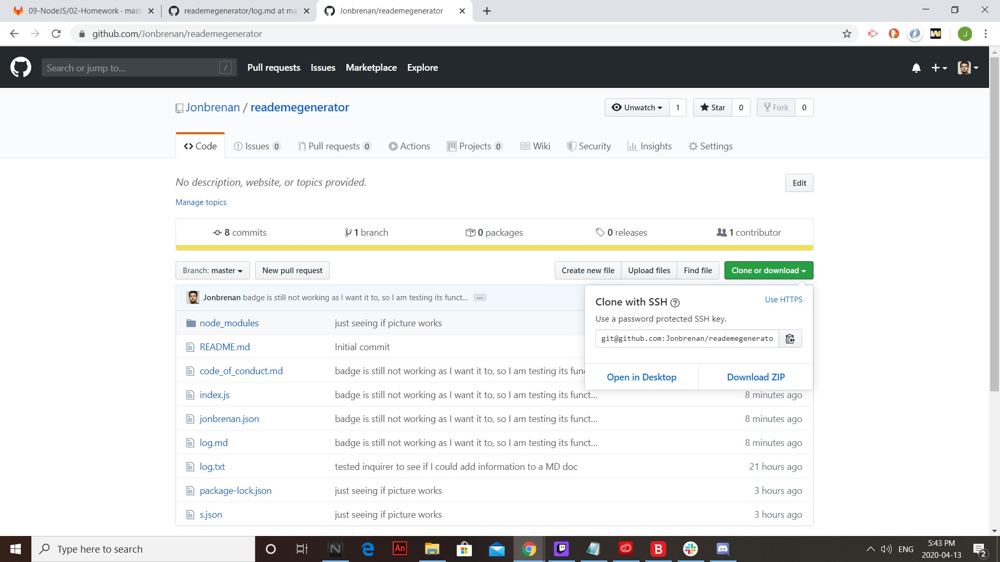
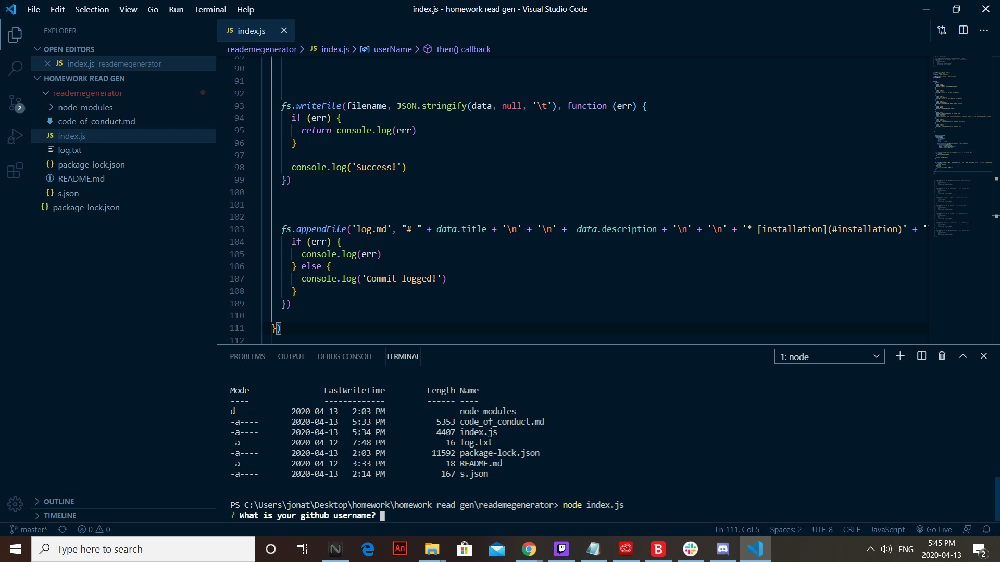

# README Generator

# Description
The README generator functions as the name implies; it generates a README for the user in a quick and efficient manner so that the user can focus more time on their code project instead of generating a README. The README generator is accessed through the VS Code terminal. 

* [description](#description)
* [installation](#installation)
* [usage](#usage)
* [license](#license)
* [contributing](#contributing)
* [tests](#tests)
* [questions](#questions)

# Installation
To install the application, access the Github repository: https://github.com/Jonbrenan/reademegenerator then simply click the “clone or download” button and either save the document as a zip file or clone the repository to your computer using gitbash. 

# Usage
To use the application, simply open the file in a code editing program (VS Code) and find the index.js file. Once index.js has been found, open the terminal and run the command “node index.js”. From here, terminal will prompt you to answer several questions regarding the creation of the README. 

# License
Licensed under the [MIT](LICENSE.txt) license
 
# Contributing
To see how one can contribute to the application, simply click the “Contributor Covenant” badge below. 

# Tests
no tests

# Questions

null